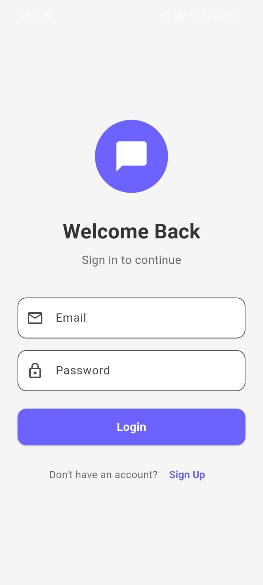
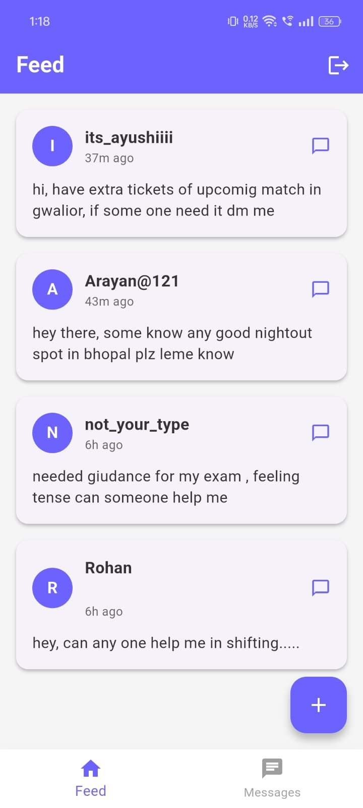
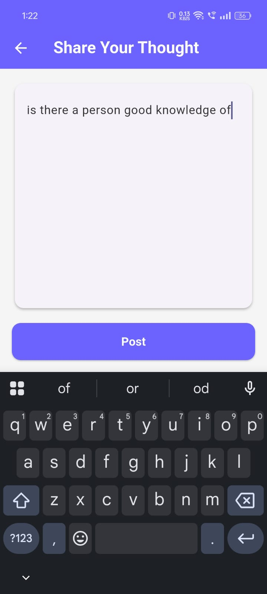
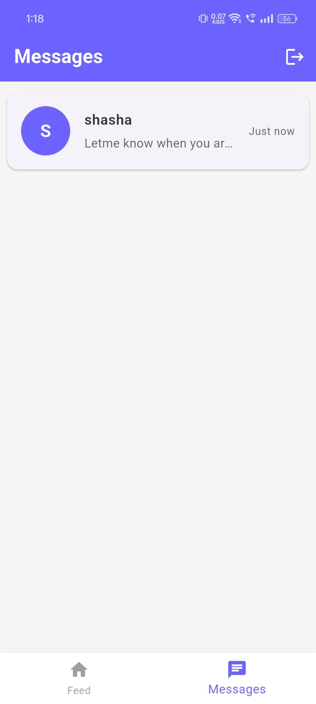
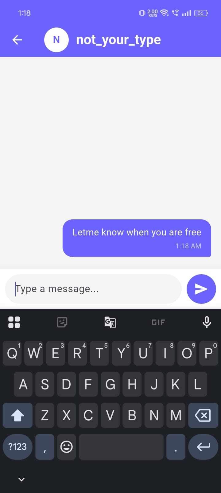
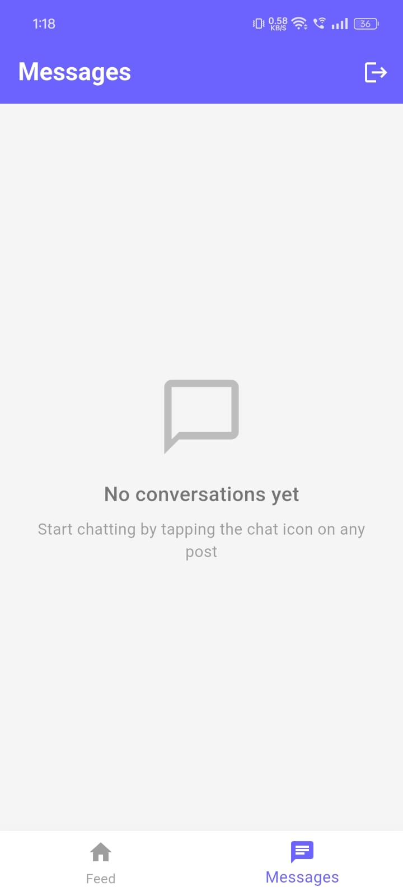

# 💬 ThoughtShare

<div align="center">
  
  **Share your thoughts, connect through conversations**
  
  [](https://flutter.dev)
  [](https://firebase.google.com)
  [](https://dart.dev)
  [](https://m3.material.io/)
  
</div>

---

## 📖 About ThoughtShare

**ThoughtShare** is a social messaging platform that bridges public expression with private conversation. Share your thoughts with the community through posts, discover interesting perspectives from others, and seamlessly transition into one-on-one chats with people whose ideas resonate with you.

### What You Can Do:

**📝 Share Your Thoughts**
- Post text updates to a public feed
- Express ideas, questions, or daily reflections
- Your posts are visible to all users in real-time

**🔍 Discover & Connect**
- Browse posts from the community feed
- See what others are thinking and sharing
- Find people with similar interests or perspectives

**💬 Start Conversations**
- Tap the chat icon on any post to message the author
- Have private one-on-one conversations
- Build connections through direct messaging

**📬 Manage Your Chats**
- View all your conversations in one place
- See unread message counts at a glance
- Quick access to ongoing discussions
- Messages update in real-time

**👤 Simple Account Management**
- Create an account with email and username
- Secure authentication and data protection
- Easy sign-in/sign-out

---

## 📸 Screenshots

<table>
  <tr>
    <td align="center"><b>Login</b></td>
    <td align="center"><b>Feed</b></td>
    <td align="center"><b>Create Post</b></td>
  </tr>
  <tr>
    <td></td>
    <td></td>
    <td></td>
  </tr>
  <tr>
    <td align="center"><b>Messages List</b></td>
    <td align="center"><b>Chat</b></td>
    <td align="center"><b>Navigation</b></td>
  </tr>
  <tr>
    <td></td>
    <td></td>
    <td></td>
  </tr>
</table>
---

## 🛠️ Tech Stack

<table>
  <tr>
    <td align="center" width="96">
      
      <br>Flutter
    </td>
    <td align="center" width="96">
      
      <br>Dart
    </td>
    <td align="center" width="96">
      
      <br>Firebase
    </td>
    <td align="center" width="96">
      
      <br>Firestore
    </td>
    <td align="center" width="96">
      
      <br>Material 3
    </td>
    <td align="center" width="96">
      
      <br>Android
    </td>
    <td align="center" width="96">
      
      <br>iOS
    </td>
  </tr>
</table>

**Frontend:** Flutter 3.0+ • Dart 2.17+ • Material Design 3  
**Backend:** Firebase Authentication • Cloud Firestore  
**Architecture:** MVC Pattern • Service Layer • Real-time Streams

---

## 🚀 Quick Start

```bash
# Clone repository
git clone https://github.com/yourusername/thoughtshare.git
cd thoughtshare

# Install dependencies
flutter pub get

# Run app
flutter run
```

### Prerequisites
- Flutter SDK 3.0+
- Firebase project ([Setup Guide](https://firebase.google.com/docs/flutter/setup))
- Add `google-services.json` (Android) & `GoogleService-Info.plist` (iOS)

---

## 🔧 Firebase Setup

1. Create Firebase project at [console.firebase.google.com](https://console.firebase.google.com)
2. Enable **Authentication** → Email/Password
3. Create **Firestore Database** → Production mode
4. Add your app configuration files
5. Deploy security rules:

```javascript
rules_version = '2';
service cloud.firestore {
  match /databases/{database}/documents {
    match /users/{userId} {
      allow read: if true;
      allow write: if request.auth.uid == userId;
    }
    match /posts/{postId} {
      allow read: if true;
      allow create: if request.auth != null;
      allow delete: if request.auth.uid == resource.data.userId;
    }
    match /chats/{chatId} {
      allow read, write: if request.auth.uid in resource.data.participants;
      match /messages/{messageId} {
        allow read, write: if request.auth.uid in get(/databases/$(database)/documents/chats/$(chatId)).data.participants;
      }
    }
  }
}
```

---

## 📁 Project Structure

```
lib/
├── models/          # User, Post, Message, Chat
├── screens/         # Login, Signup, Feed, Chat, Messages
├── services/        # Auth, Post, Chat business logic
├── widgets/         # PostCard, MessageBubble, ChatListItem
├── utils/           # Constants, Helpers
└── main.dart
```

---

## ✨ Key Features

✅ Email/password authentication  
✅ Public social feed with real-time updates  
✅ Create and share text posts  
✅ One-on-one private messaging  
✅ Conversation list with unread badges  
✅ Tap-to-chat from any post  
✅ Material Design 3 UI  
✅ Cross-platform (Android & iOS)

---

## 🔐 Security

- Firebase Authentication with JWT tokens
- Firestore security rules for data protection
- Participant-only access to private chats
- Input validation on all forms
- Encrypted HTTPS communication

---

## 📱 Build

```bash
# Android
flutter build apk --release

# iOS
flutter build ipa --release
```

---

## 🚦 Future Enhancements

- [ ] Image/media sharing in posts and messages
- [ ] Group chat functionality
- [ ] Push notifications for new messages
- [ ] User profile with avatar
- [ ] Post likes and comments
- [ ] Dark mode theme


---

## 👨‍💻 Author

**Shashank Agrawal**  
📧 agrawalshashank51@gmail.com  
🔗 [GitHub](https://github.com/shashank090704) • [LinkedIn](https://www.linkedin.com/in/agshashank/)

---

<div align="center">
  
  **Built with ❤️ using Flutter**
  
  ⭐ Star this repo if you find it helpful!
  
</div>
